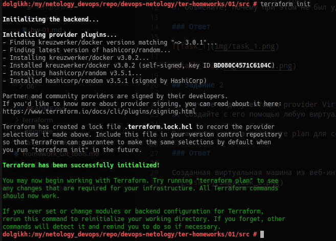
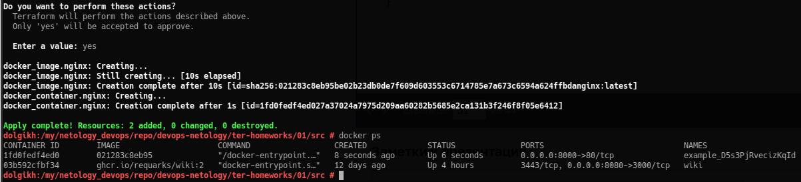
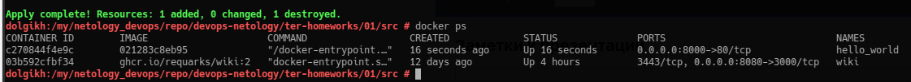
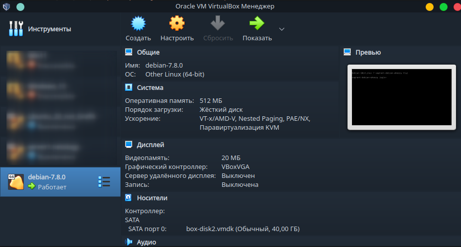

# Домашнее задание к занятию «Введение в Terraform»

## Задание 1

1. Перейдите в каталог src. Скачайте все необходимые зависимости, использованные в проекте.
2. Изучите файл .gitignore. В каком terraform файле согласно этому .gitignore допустимо сохранить личную, секретную информацию?
3. Выполните код проекта. Найдите в State-файле секретное содержимое созданного ресурса random_password, пришлите в качестве ответа конкретный ключ и его значение.
4. Раскомментируйте блок кода, примерно расположенный на строчках 29-42 файла main.tf. Выполните команду terraform validate. Объясните в чем заключаются намеренно допущенные ошибки? Исправьте их.
5. Выполните код. В качестве ответа приложите вывод команды docker ps
6. Замените имя docker-контейнера в блоке кода на hello_world. Не перепутайте имя контейнера и имя образа. Мы все еще продолжаем использовать name = "nginx:latest"! Выполните команду terraform apply -auto-approve. Объясните своими словами, в чем может быть опасность применения ключа -auto-approve ? В качестве ответа дополнительно приложите вывод команды docker ps
7. Уничтожьте созданные ресурсы с помощью terraform. Убедитесь, что все ресурсы удалены. Приложите содержимое файла terraform.tfstate.
8. Объясните, почему при этом не был удален docker образ nginx:latest ? Ответ подкрепите выдержкой из документации провайдера docker.

### Ответы

1. Вывод команды `terraform init`:



2. В файле `personal.auto.tfvars`
3. 
```bash
"result": "D5s3PjRvecizKqId"
```
4. После выполнения кода получил следующие ошибки:
 - для ресурса с типом `docker_image` не было указано имя;
 - имя ресурса `docker_container` не соответствовало требованиям. Исходя из подсказки в выводе имя ресурса должно начинаться с буквы или `_`;
 - в строке `name  = "example_${random_password.random_string_FAKE.resulT}"` было допущено сразу две ошибки: `random_string_FAKE` и `resulT`. Исправленная строка должна выглядеть так: 
 `name  = "example_${random_password.random_string.result}"`. Да и вообще, очень странно светить пароль в имени контейнера!
5. В выводе два контейнера потому что один из них действующий (`03b592cfbf34`) и был запущен ранее, а контейнер `1fd0fedf4ed0` - это результат выполнения этого подпункта.



6. Выполнять `-auto-approve` это как прыгать с парашютом не проверив сам парашют. Надо быть на 100% уверенным какие изменения будут внесены.



7. 
```bash
dolgikh:/my/netology_devops/repo/devops-netology/ter-homeworks/01/src # cat terraform.tfstate
{
  "version": 4,
  "terraform_version": "1.5.3",
  "serial": 11,
  "lineage": "4a1c32e3-5568-2f44-af9d-edc5d8f60b70",
  "outputs": {},
  "resources": [],
  "check_results": null
}
```
8. Потому что в блоке ресурса БЫЛ указан требуемый для этого параметр и его значение `keep_locally = true`:
> keep_locally (Boolean) If true, then the Docker image won't be deleted on destroy operation. If this is false, it will delete the image from the docker local storage on destroy operation.

[Ссылка на документацию](https://docs.comcloud.xyz/providers/kreuzwerker/docker/latest/docs/resources/image)

## Задание 2

1. Изучите в документации provider Virtualbox от shekeriev.
2. Создайте с его помощью любую виртуальную машину. Чтобы не использовать VPN советуем выбрать любой образ с расположением в github из списка

В качестве ответа приложите plan для создаваемого ресурса и скриншот созданного в VB ресурса.

### Ответ

```bash
dolgikh:/my/netology_devops/repo/devops-netology/ter-homeworks/01/vb # terraform plan

Terraform used the selected providers to generate the following execution plan. Resource actions are indicated with the following symbols:
  + create

Terraform will perform the following actions:

  # virtualbox_vm.vm1 will be created
  + resource "virtualbox_vm" "vm1" {
      + cpus   = 1
      + id     = (known after apply)
      + image  = "https://github.com/kraksoft/vagrant-box-debian/releases/download/7.8.0/debian-7.8.0-amd64.box"
      + memory = "512 mib"
      + name   = "debian-7.8.0"
      + status = "running"

      + network_adapter {
          + device                 = "IntelPro1000MTDesktop"
          + host_interface         = "eth0"
          + ipv4_address           = (known after apply)
          + ipv4_address_available = (known after apply)
          + mac_address            = (known after apply)
          + status                 = (known after apply)
          + type                   = "bridged"
        }
    }

Plan: 1 to add, 0 to change, 0 to destroy.

Changes to Outputs:
  + IPAddress = (known after apply)

────────────────────────────────────────────────────────────────────────────────────────────────────────────────────────────────────────────────────────────────────────────────────────────────────────────────────────────────────────────── 

Note: You didn't use the -out option to save this plan, so Terraform can't guarantee to take exactly these actions if you run "terraform apply" now.
```

Вывод `vboxmanage` после выполнения `terraform apply`:

```bash
dolgikh:/my/netology_devops/repo/devops-netology/ter-homeworks/01/vb # vboxmanage list runningvms
"debian-7.8.0" {a8c0a23e-a10a-4cfe-ae41-01417fd294b1}
```


