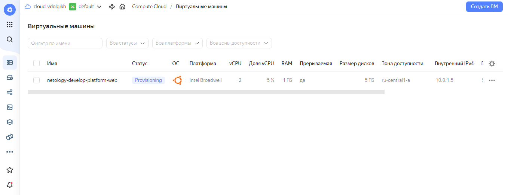
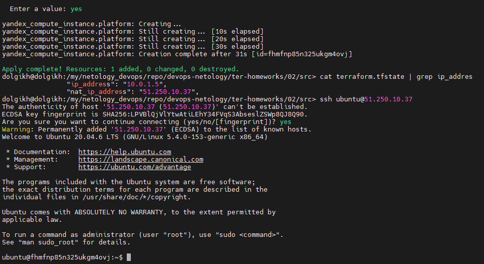

# Домашнее задание к занятию «Введение в Terraform»

## Задание 1

1. Изучите проект. В файле variables.tf объявлены переменные для Yandex provider.
2. Переименуйте файл personal.auto.tfvars_example в personal.auto.tfvars. Заполните переменные: идентификаторы облака, токен доступа. Благодаря .gitignore этот файл не попадёт в публичный репозиторий. Вы можете выбрать иной способ безопасно передать секретные данные в terraform.
3. Сгенерируйте или используйте свой текущий ssh-ключ. Запишите его открытую часть в переменную vms_ssh_root_key.
4. Инициализируйте проект, выполните код. Исправьте намеренно допущенные синтаксические ошибки. Ищите внимательно, посимвольно. Ответьте, в чём заключается их суть.
5. Ответьте, как в процессе обучения могут пригодиться параметры preemptible = true и core_fraction=5 в параметрах ВМ. Ответ в документации Yandex Cloud.

### Ответы

Скриншот созданной виртуальной машины в облаке:



Скриншот консоли с подключением к виртуальной машине по ssh:



4. При выполнении `terraform apply` я столкнулся с некоторыми ошибками:
- `platform_id` содержал значение с опечаткой `standart-v4`. Исправил на `standard-v1` (в документации написано что по-умолчанию именно v1;
- минимальное допустимое значение для `cores` является `2`.

5. Как я понял, `scheduling_policy` и его `preemptible` соответствуют галочке `Прерываемая` в веб-морде ЯК. В документации сказано:
> ВМ, которая работает не более 24 часов и может быть остановлена Compute Cloud в любой момент. После остановки ВМ не удаляется, все ее данные сохраняются. Чтобы продолжить работу, запустите ВМ повторно. Предоставляется с большой скидкой.

`core_fraction` в свою очередь указывает на базовую производительсть ядра в процентах. Оба параметра удешевляют стоимость одной виртуальной машины. 
Исходя из вышесказанного, полагаю, что более экономный расход финансов позволит успеть намного больше в процессе обучения.

## Задание 4

1. Объявите в файле `outputs.tf` output типа map, содержащий `{ instance_name = external_ip }` для каждой из ВМ.
2. Примените изменения.

В качестве решения приложите вывод значений ip-адресов команды `terraform output`.

### Ответ

```bash
dolgikh@dolgikh:/my/netology_devops/repo/devops-netology/3_terraform-homeworks/tf_02/src> terraform output
vm_db = {
  "external_ip" = "51.250.87.75"
  "instance_name" = "netology-develop-platform-db"
}
vm_web = {
  "external_ip" = "51.250.82.43"
  "instance_name" = "netology-develop-platform-web"
}
```

## Задание 5

1. В файле locals.tf опишите в одном local-блоке имя каждой ВМ, используйте интерполяцию ${..} с несколькими переменными по примеру из лекции.
2. Замените переменные с именами ВМ из файла variables.tf на созданные вами local-переменные.
3. Примените изменения.

### Ответ

1. Содержимое файла locals.tf:

```bash
locals {
  vm_name_web = "${var.vm_properties["company"]}-${var.vm_properties["env"]}-${var.vm_properties["web"]}"
  vm_name_db  = "${var.vm_properties["company"]}-${var.vm_properties["env"]}-${var.vm_properties["db"]}"
}
```

2. Переменная в variables.tf:

```bash
variable "vm_properties" {
  type        = map
  default     = {
    company   = "netology"
    env       = "develop"
    web       = "platform-web"
    db        = "platform-db"
  }
}
```

([Ссылка на файл locals.tf](https://github.com/vdolgikh/devops-netology/blob/main/3_terraform-homeworks/tf_02/src/locals.tf))

([Ссылка на файл variables.tf](https://github.com/vdolgikh/devops-netology/blob/main/3_terraform-homeworks/tf_02/src/variables.tf))

## Задание 6

1. Вместо использования трёх переменных ".._cores",".._memory",".._core_fraction" в блоке resources {...}, объедините их в переменные типа map с именами "vm_web_resources" и "vm_db_resources". В качестве продвинутой практики попробуйте создать одну map-переменную vms_resources и уже внутри неё конфиги обеих ВМ — вложенный map.
2. Также поступите с блоком metadata {serial-port-enable, ssh-keys}, эта переменная должна быть общая для всех ваших ВМ.
3. Найдите и удалите все более не используемые переменные проекта.
4. Проверьте terraform plan. Изменений быть не должно.

### Ответ

1. Переменные в файле vms_platform.tf:

```bash
variable "vm_web_resources" {
  type    = map
  default = {
    cpu   = 2
    ram   = 1
    core_fraction = 5
  }
}

variable "vm_db_resources" {
  type    = map
  default = {
    cpu   = 2
    ram   = 2
    core_fraction = 20
  }
}
```

2. Переменная в файле variables.tf:

```bash
variable "vms_metadata" {
  type         = map
  default      = {
    serial     = 1
    ssh_root_key = "ubuntu:ssh-ed25519 AAAAC3NzaC1lZDI1NTE5AAAAIAsq2ExfK3566dlMj6YsJ+wv7JJdMSN4C6w1aChS2qJH dolgikh@dolgikh"
  }
}
```

([Ссылка на файл vms_platform.tf](https://github.com/vdolgikh/devops-netology/blob/main/3_terraform-homeworks/tf_02/src/vms_platform.tf))

([Ссылка на файл variables.tf](https://github.com/vdolgikh/devops-netology/blob/main/3_terraform-homeworks/tf_02/src/variables.tf))

3. Зачистил неиспользуемые более переменные.

4. Как результат выполнил `terraform plan` - изменений не было.
