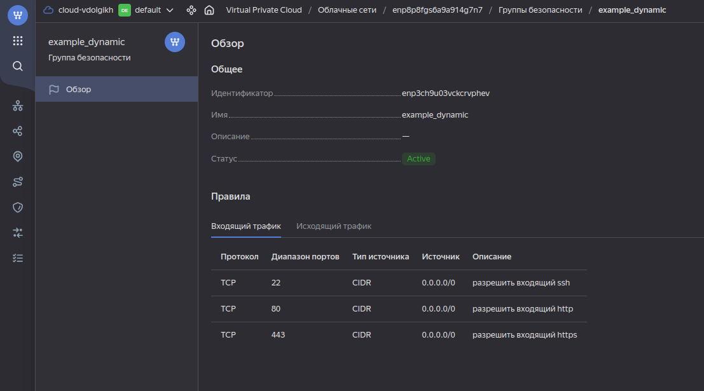
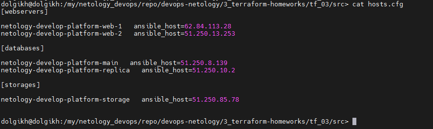

# Домашнее задание к занятию «Управляющие конструкции в коде Terraform»

## Задание 1

1. Изучите проект.
2. Заполните файл personal.auto.tfvars.
3. Инициализируйте проект, выполните код. Он выполнится, даже если доступа к preview нет.

Приложите скриншот входящих правил «Группы безопасности» в ЛК Yandex Cloud или скриншот отказа в предоставлении доступа к preview-версии.

### Ответы



## Задание 2

1. Создайте файл count-vm.tf. Опишите в нём создание двух одинаковых ВМ web-1 и web-2 (не web-0 и web-1) с минимальными параметрами, используя мета-аргумент count loop. Назначьте ВМ созданную в первом задании группу безопасности.(как это сделать узнайте в документации провайдера yandex/compute_instance )
2. Создайте файл for_each-vm.tf. Опишите в нём создание двух ВМ с именами "main" и "replica" разных по cpu/ram/disk , используя мета-аргумент for_each loop. Используйте для обеих ВМ одну общую переменную типа list(object({ vm_name=string, cpu=number, ram=number, disk=number })). При желании внесите в переменную все возможные параметры.
3. ВМ из пункта 2.2 должны создаваться после создания ВМ из пункта 2.1.
4. Используйте функцию file в local-переменной для считывания ключа ~/.ssh/id_rsa.pub и его последующего использования в блоке metadata, взятому из ДЗ 2.
5. Инициализируйте проект, выполните код.

### Ответ

1. ([Ссылка на файл count-vm.tf](https://github.com/vdolgikh/devops-netology/blob/main/3_terraform-homeworks/tf_03/src/count-vm.tf))

Для того, чтобы счет машин начинался с 1, а не с 0 написал такую переменную:

```bash
variable "platform_number" {
  default = {
    "0" = "1"
    "1" = "2"
  }
  description = "For instance count start at 1"
}
```

Для назначения группы использовал параметр `security_group_ids` с указанием зависимости:

```bash
network_interface {
    subnet_id = yandex_vpc_subnet.develop.id
    nat       = true
    security_group_ids = [yandex_vpc_security_group.example.id]
  }
  depends_on = [
    yandex_vpc_security_group.example
  ]
```

2. Создание двух ВМ с разными ресурсами описал с помощью локальных переменных:

```bash
vms = {
    "main"    = { cpu = "2", ram = "1", disk = "6" },
    "replica" = { cpu = "2", ram = "2", disk = "5" }
  }
```

([Ссылка на файл locals.tf](https://github.com/vdolgikh/devops-netology/blob/main/3_terraform-homeworks/tf_03/src/locals.tf))

([Ссылка на файл for_each-vm.tf](https://github.com/vdolgikh/devops-netology/blob/main/3_terraform-homeworks/tf_03/src/for_each-vm.tf))

3. Для этого при описании создания ВМ из пункта 2.2 указал зависимость:

```bash
depends_on = [
    yandex_compute_instance.web
  ]
```
4. Получилось так:

```bash
ssh_public_key = "${file("~/.ssh/id_rsa.pub")}"
```

([Ссылка на файл locals.tf](https://github.com/vdolgikh/devops-netology/blob/main/3_terraform-homeworks/tf_03/src/locals.tf))

5. Готово.

## Задание 3

1. Создайте 3 одинаковых виртуальных диска размером 1 Гб с помощью ресурса yandex_compute_disk и мета-аргумента count в файле disk_vm.tf .
2. Создайте в том же файле одну ВМ c именем "storage" . Используйте блок dynamic secondary_disk{..} и мета-аргумент for_each для подключения созданных вами дополнительных дисков.

### Ответ

1. Создание 3 одинаковых диска с помощью мета-аргумента count:

```bash
resource "yandex_compute_disk" "ext_disk" {
  count    = 3
  name     = "ext-disk-${count.index}"
  type     = "network-ssd"
  zone     = "ru-central1-a"
  size     = 1
}
```

2. ([Ссылка на файл disk_vm.tf](https://github.com/vdolgikh/devops-netology/blob/main/3_terraform-homeworks/tf_03/src/disk_vm.tf))

## Задание 4

1. В файле ansible.tf создайте inventory-файл для ansible. Используйте функцию tepmplatefile и файл-шаблон для создания ansible inventory-файла из лекции. Готовый код возьмите из демонстрации к лекции demonstration2. Передайте в него в качестве переменных группы виртуальных машин из задания 2.1, 2.2 и 3.2, т. е. 5 ВМ.
2. Инвентарь должен содержать 3 группы [webservers], [databases], [storage] и быть динамическим, т. е. обработать как группу из 2-х ВМ, так и 999 ВМ.
3. Выполните код. Приложите скриншот получившегося файла.

### Ответ

1. Получилась такая конструкция:

```bash
resource "local_file" "hosts_cfg" {
  content = templatefile("${path.module}/hosts.tftpl",
    {
     webservers =  yandex_compute_instance.web,
     databases  =  yandex_compute_instance.database,
     storages   =  yandex_compute_instance.storage,
    }
  )
  filename = "${abspath(path.module)}/hosts.cfg"
}
```

([Ссылка на файл ansible.tf](https://github.com/vdolgikh/devops-netology/blob/main/3_terraform-homeworks/tf_03/src/ansible.tf))

2. Содержимое шаблона файла инвентаря:

```bash
[webservers]

%{~ for i in webservers ~}

${i["name"]}   ansible_host=${i["network_interface"][0]["nat_ip_address"]}
%{~ endfor ~}


[databases]

%{~ for i in databases ~}

${i["name"]}   ansible_host=${i["network_interface"][0]["nat_ip_address"]}
%{~ endfor ~}


[storages]

%{~ for i in storages ~}

${i["name"]}   ansible_host=${i["network_interface"][0]["nat_ip_address"]}
%{~ endfor ~}
```

([Ссылка на файл hosts.tftpl](https://github.com/vdolgikh/devops-netology/blob/main/3_terraform-homeworks/tf_03/src/hosts.tftpl))

3. Код выполняется без ошибок.




