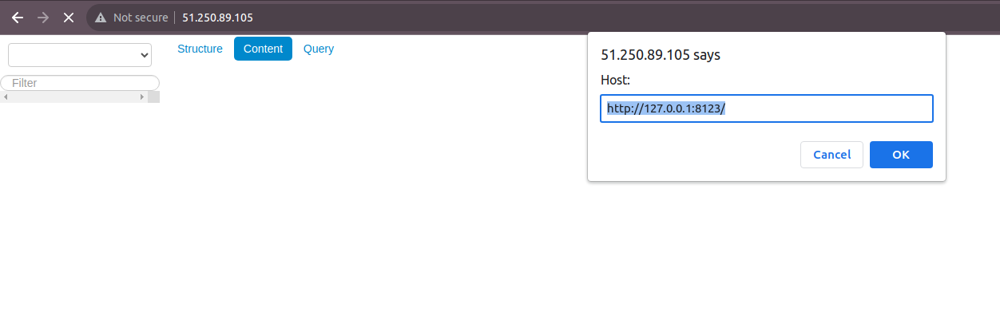

# Домашнее задание к занятию 3 «Использование Ansible»

## Основная часть

1. Допишите playbook: нужно сделать ещё один play, который устанавливает и настраивает LightHouse.
2. При создании tasks рекомендую использовать модули: `get_url`, `template`, `yum`, `apt`.
3. Tasks должны: скачать статику LightHouse, установить Nginx или любой другой веб-сервер, настроить его конфиг для открытия LightHouse, запустить веб-сервер.
4. Подготовьте свой inventory-файл `prod.yml`.
5. Запустите `ansible-lint site.yml` и исправьте ошибки, если они есть.
6. Попробуйте запустить playbook на этом окружении с флагом `--check`.
7. Запустите playbook на `prod.yml` окружении с флагом `--diff`. Убедитесь, что изменения на системе произведены.
8. Повторно запустите playbook с флагом `--diff` и убедитесь, что playbook идемпотентен.
9. Подготовьте README.md-файл по своему playbook. В нём должно быть описано: что делает playbook, какие у него есть параметры и теги.
10. Готовый playbook выложите в свой репозиторий, поставьте тег `08-ansible-03-yandex` на фиксирующий коммит, в ответ предоставьте ссылку на него.

### Ответы

1. Дописал следующий Play:

```bash
- name: Install NGINX
  hosts: clickhouse
  handlers:
    - name: Start-nginx
      become: true
      ansible.builtin.command: nginx
    - name: Reload-nginx
      become: true
      ansible.builtin.command: nginx -s reload
  tasks:
    - name: Install epel-release
      become: true
      ansible.builtin.yum:
        name: epel-release
        state: present
    - name: Install NGINX
      become: true
      ansible.builtin.yum:
        name: nginx
        state: present
      notify: Start-nginx
    - name: Create config
      become: true
      ansible.builtin.template:
        src: templates/nginx.conf.j2
        dest: /etc/nginx/nginx.conf
        mode: "0644"
      notify: Reload-nginx
- name: Install LightHouse
  hosts: clickhouse
  handlers:
    - name: Reload-nginx
      become: true
      ansible.builtin.command: nginx -s reload
  pre_tasks:
    - name: Install dependencies
      become: true
      ansible.builtin.yum:
        name: git
        state: present
  tasks:
    - name: Get LightHouse from git
      become: true
      ansible.builtin.git:
        repo: "{{ lighthouse_vsc }}"
        version: master
        dest: "{{ lighthouse_location_dir }}"
    - name: Create LightHouse config
      become: true
      ansible.builtin.template:
        src: templates/lighthouse.conf.j2
        dest: /etc/nginx/conf.d/lighthouse.conf
        mode: "0644"
      notify: Reload-nginx
```

2. Использовал `yum`, `git`, `template`, `mode` и `command`.
3. Сделал.
4. Сделал. 
5. Исправил.
6. Запустил.
7. Изменения в системе произведены. Результат:



8. Команду выполнил. Результат:
```bash
PLAY RECAP *************************************************************************************************************
clickhouse-01              : ok=16   changed=0    unreachable=0    failed=0    skipped=0    rescued=1    ignored=0   
```
9. [Ссылка на документацию](playbook/readme.md).
10. Ссылку прикрепил отдельно к ответу по ДЗ в личном кабинете нетологии.