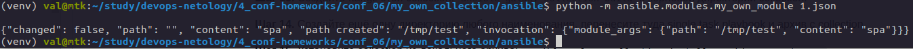
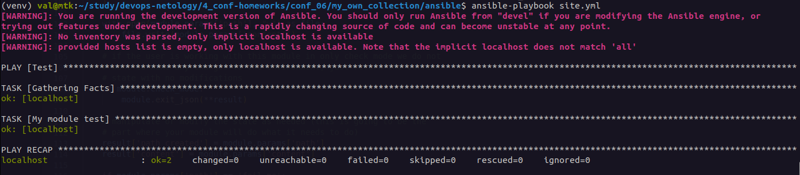
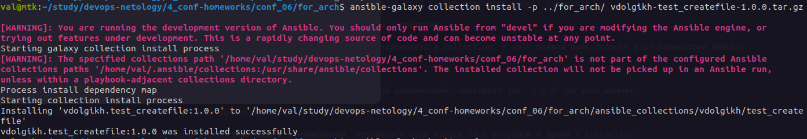
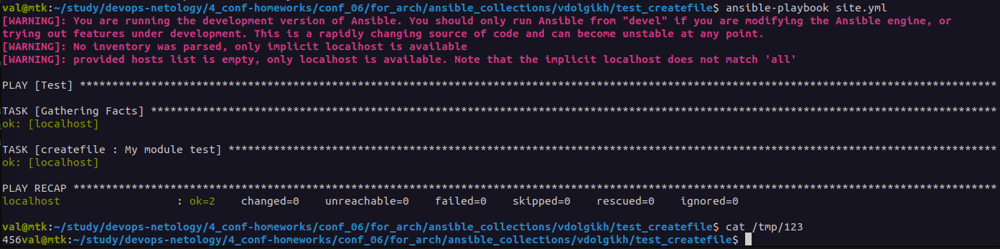

# Домашнее задание к занятию 6 «Создание собственных модулей»

## Основная часть

**Шаг 1.** В виртуальном окружении создайте новый `my_own_module.py` файл.

**Шаг 2.** Наполните его содержимым.

**Шаг 3.** Заполните файл в соответствии с требованиями Ansible так, чтобы он выполнял основную задачу: module должен создавать текстовый файл на удалённом хосте по пути, определённом в параметре `path`, с содержимым, определённым в параметре `content`.

**Шаг 4.** Проверьте module на исполняемость локально.

**Шаг 5.** Напишите single task playbook и используйте module в нём.

**Шаг 6.** Проверьте через playbook на идемпотентность.

**Шаг 7.** Выйдите из виртуального окружения.

**Шаг 8.** Инициализируйте новую collection: `ansible-galaxy collection init my_own_namespace.yandex_cloud_elk`.

**Шаг 9.** В эту collection перенесите свой module в соответствующую директорию.

**Шаг 10.** Single task playbook преобразуйте в single task role и перенесите в collection. У role должны быть default всех параметров module.

**Шаг 11.** Создайте playbook для использования этой role.

**Шаг 12.** Заполните всю документацию по collection, выложите в свой репозиторий, поставьте тег `1.0.0` на этот коммит.

**Шаг 13.** Создайте .tar.gz этой collection: `ansible-galaxy collection build` в корневой директории collection.

**Шаг 14.** Создайте ещё одну директорию любого наименования, перенесите туда single task playbook и архив c collection.

**Шаг 15.** Установите collection из локального архива: `ansible-galaxy collection install <archivename>.tar.gz`.

**Шаг 16.** Запустите playbook, убедитесь, что он работает.

**Шаг 17.** В ответ необходимо прислать ссылки на collection и tar.gz архив, а также скриншоты выполнения пунктов 4, 6, 15 и 16.

---

### Ответы

1. Ок
2. Скопировал из задания
3. Заполнил, добавил функцию:

```python
with open(module.params['path'], "w") as file:
        file.write(module.params['content'])
```
4. Исполняется, возвращает значения:



5. Написал playbook с таким содержанием:

```yaml
---
- name: Test
  hosts: localhost
  tasks:
    - name: My module test
      my_own_module:
        path: /tmp/123
        content: 456
```

6. Результат:



7. Ок
8. Инициализировал с именем `vdolgikh.test_createfile`
9. Ок
10. Ок
11. Создал `site.yml`:

```yaml
---
- name: Test
  hosts: localhost
  roles:
    - createfile
```

12. Ок
13. Архив создал
14. Создал, перенес
15. Результат:



16. Результат:



17. Прикрепил ссылки к домашнему заданию.

---