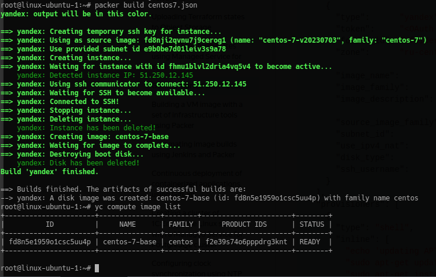
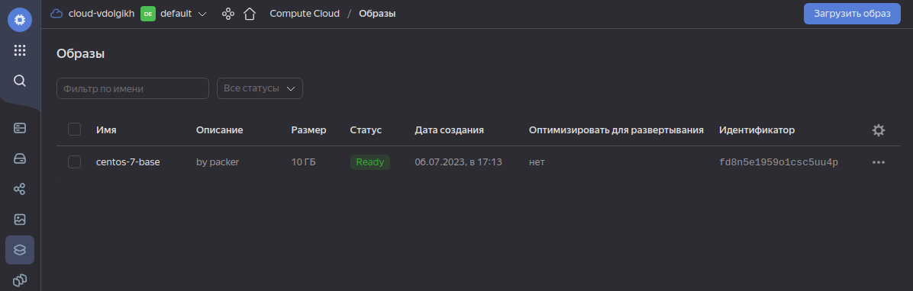
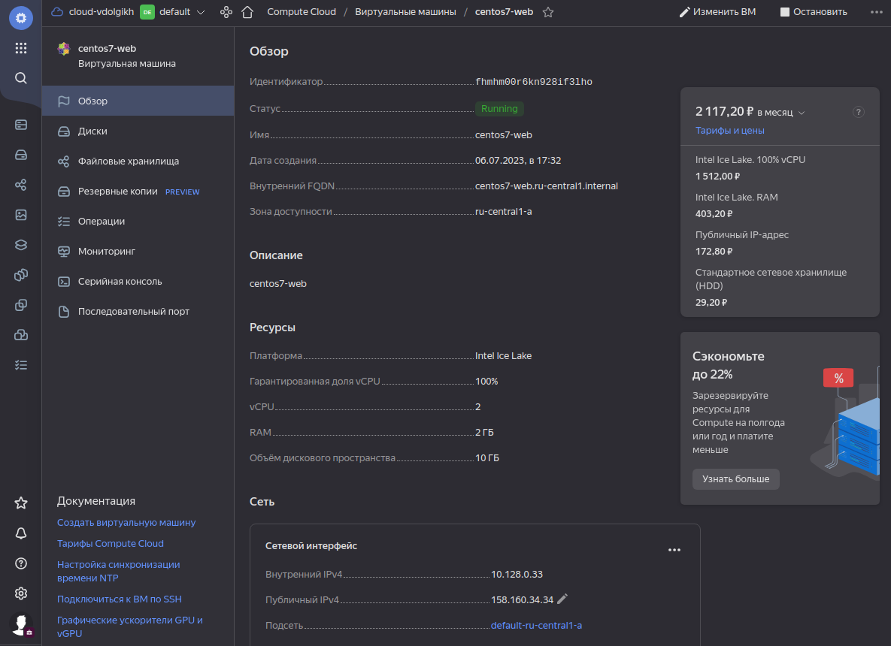
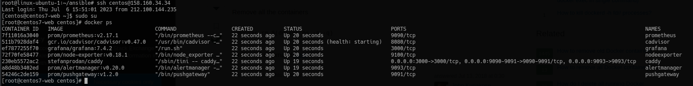
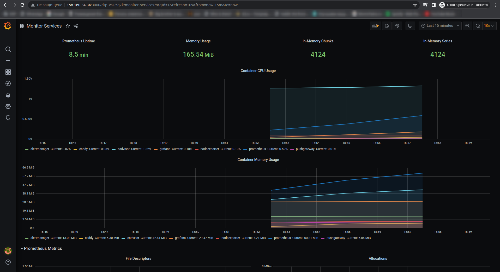

# Домашнее задание к занятию «Оркестрация группой Docker-контейнеров на примере Docker Compose»

## Задача 1

Создайте собственный образ любой операционной системы (например ubuntu-20.04) с помощью Packer ([инструкция](https://cloud.yandex.ru/docs/tutorials/infrastructure-management/packer-quickstart)).

Чтобы получить зачёт, вам нужно предоставить скриншот страницы с созданным образом из личного кабинета YandexCloud.

### Ответ





## Задача 2

**2.1.** Создайте вашу первую виртуальную машину в YandexCloud с помощью web-интерфейса YandexCloud.        

Чтобы получить зачёт, вам нужно предоставить вывод команды terraform apply и страницы свойств, созданной ВМ из личного кабинета YandexCloud.

### Ответ

Созданная виртуальная машина из веб-интерфейса:
 

## Задача 3

С помощью Ansible и Docker Compose разверните на виртуальной машине из предыдущего задания систему мониторинга на основе Prometheus/Grafana.
Используйте Ansible-код в директории ([src/ansible](https://github.com/netology-group/virt-homeworks/tree/virt-11/05-virt-04-docker-compose/src/ansible)).

Чтобы получить зачёт, вам нужно предоставить вывод команды "docker ps" , все контейнеры, описанные в [docker-compose](https://github.com/netology-group/virt-homeworks/blob/virt-11/05-virt-04-docker-compose/src/ansible/stack/docker-compose.yaml),  должны быть в статусе "Up".

### Ответ

```bash
[root@centos7-web centos]# docker ps
CONTAINER ID   IMAGE                              COMMAND                  CREATED          STATUS                             PORTS                                                                              NAMES
7f11016a3040   prom/prometheus:v2.17.1            "/bin/prometheus --c…"   22 seconds ago   Up 20 seconds                      9090/tcp                                                                           prometheus
511b7928daf4   gcr.io/cadvisor/cadvisor:v0.47.0   "/usr/bin/cadvisor -…"   22 seconds ago   Up 20 seconds (health: starting)   8080/tcp                                                                           cadvisor
ef7877255f70   grafana/grafana:7.4.2              "/run.sh"                22 seconds ago   Up 20 seconds                      3000/tcp                                                                           grafana
72f70fe58477   prom/node-exporter:v0.18.1         "/bin/node_exporter …"   22 seconds ago   Up 20 seconds                      9100/tcp                                                                           nodeexporter
230eb5572ac2   stefanprodan/caddy                 "/sbin/tini -- caddy…"   22 seconds ago   Up 19 seconds                      0.0.0.0:3000->3000/tcp, 0.0.0.0:9090-9091->9090-9091/tcp, 0.0.0.0:9093->9093/tcp   caddy
a8d48b3402ed   prom/alertmanager:v0.20.0          "/bin/alertmanager -…"   22 seconds ago   Up 19 seconds                      9093/tcp                                                                           alertmanager
54246c2de159   prom/pushgateway:v1.2.0            "/bin/pushgateway"       22 seconds ago   Up 20 seconds                      9091/tcp                                                                           pushgateway
[root@centos7-web centos]#
```

 

## Задача 4

1. Откройте веб-браузер, зайдите на страницу http://<внешний_ip_адрес_вашей_ВМ>:3000.
2. Используйте для авторизации логин и пароль из [.env-file](https://github.com/netology-group/virt-homeworks/blob/virt-11/05-virt-04-docker-compose/src/ansible/stack/.env).
3. Изучите доступный интерфейс, найдите в интерфейсе автоматически созданные docker-compose-панели с графиками([dashboards](https://grafana.com/docs/grafana/latest/dashboards/use-dashboards/)).
4. Подождите 5-10 минут, чтобы система мониторинга успела накопить данные.

Чтобы получить зачёт, предоставьте скриншот работающего веб-интерфейса Grafana с текущими метриками.

### Ответ


